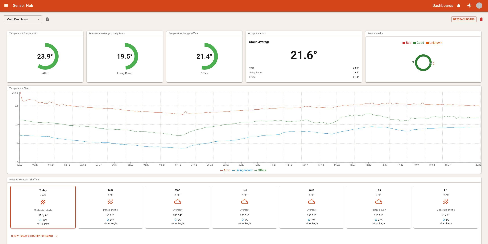
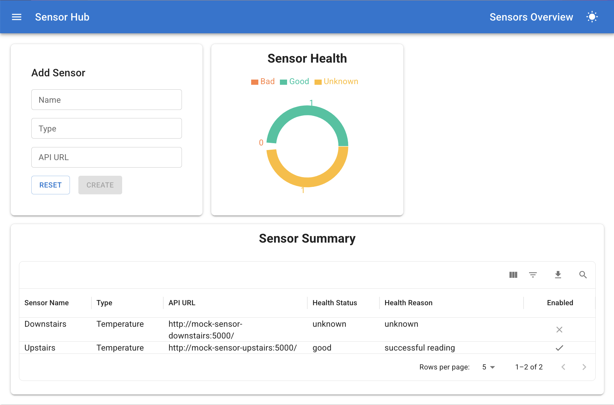
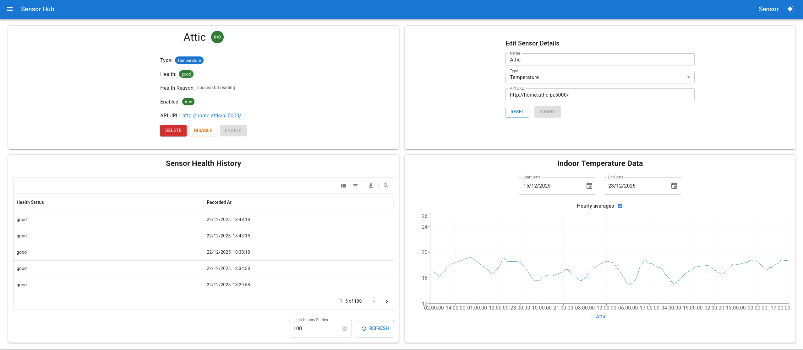

# Home temperature monitoring

A small self hosted setup for collecting, storing and viewing temperature readings from a few Raspberry Pis.

This repo contains the pieces I use to monitor a few DS18B20 sensors around the house. Three small Pis read sensors and expose a tiny HTTP endpoint. A fourth Pi runs the "sensor hub" service which gathers readings, stores them in SQLite, and serves a web UI with graphs and real time updates.

## Overview

- The backend that aggregates data and serves the UI is in `sensor_hub`. The React UI is embedded into the Go binary at build time (`sensor_hub/web/`), so a single binary serves both the API and the SPA.
- A minimal Flask API for the sensors is in `temperature_sensor`.
- The front end source lives in `sensor_hub/ui/sensor_hub_ui`.

## What this does

- Collects temperature readings from networked sensors.
- Persists readings and sensor health into an embedded SQLite database.
- Serves a REST API and a WebSocket channel for real time updates.
- Provides a Single Page App for viewing dashboards and sensor details.

## Why it exists

Because I wanted a playground to collect and visualise sensor data at home.

## Quick layout

- `sensor_hub` - Go backend, API handlers, DB code, service layer and the embedded UI.
  - `sensor_hub/web/` - embeds the built React UI into the Go binary via `//go:embed all:dist`.
  - `sensor_hub/openapi.yaml` is the API contract for the REST endpoints (all routes live under `/api`).
  - `sensor_hub/ws/hub.go` and `sensor_hub/api/websocket.go` contain the WebSocket code.
  - `sensor_hub/scripts/build.sh` - builds the React UI, copies it to `web/dist/`, and compiles the Go binary.
- `temperature_sensor` - tiny Flask app that emulates a DS18B20 sensor for local testing.
- `sensor_hub/docker` - production Docker Compose (single container: multi-stage node → go → alpine). Nginx sits in front as a TLS reverse proxy only.
- `sensor_hub/docker_tests` - dev Docker Compose with mock sensors, a separate Vite dev server for HMR, and Delve for debugging.
- `sensor_hub/db/migrations` - SQL migrations that define the schema used by the hub.
- `packaging/` - systemd unit, logrotate config, scriptlets, and production config defaults for RPM/DEB packages.
- `.goreleaser.yml` - GoReleaser configuration for cross-compilation, packaging, and GPG signing.
- `.github/workflows/release.yml` - GitHub Actions workflow that builds and publishes signed packages on tagged releases.

## Installation

The recommended way to install Sensor Hub is via RPM or DEB package from the [GitHub Releases](https://github.com/tom-molotnikoff/home-temperature-monitoring/releases) page. See the [installation guide](docs/docs/installation.md) for full instructions.

### Quick start (development)

Build and run the single binary (serves both API and React UI):

```bash
cd sensor_hub

# build the UI and Go binary in one step
./scripts/build.sh

# run the binary (uses local configuration/ directory)
./sensor-hub --config-dir=configuration
```

Run the full dev stack with fake sensors and hot-reload:

```bash
docker compose -f sensor_hub/docker_tests/docker-compose.yml up --build
```

### Build packages locally

```bash
./scripts/build-packages.sh
```

Requires [GoReleaser](https://goreleaser.com/install/). Produces unsigned snapshot RPM and DEB packages in `dist/`.

## API and WebSocket

- All API routes live under the `/api` prefix. The REST API spec is at `sensor_hub/openapi.yaml`.
- WebSocket messages and topics are handled by the hub in `sensor_hub/ws/hub.go` and integrated in `sensor_hub/api/websocket.go`.

## Configuration

- Production config lives in `/etc/sensor-hub/` (installed by the package).
- Development config lives in `sensor_hub/configuration/`.
- For Gmail SMTP and email alerts there is a small helper under `sensor_hub/pre_authorise_application` that helps produce the `credentials.json` and `token.json` files.

## Testing

```bash
cd sensor_hub
go test ./...
```

Each package has unit tests. See `docs/docs/development/testing.md` for details.

## Where to look next

- To understand the API start with `sensor_hub/openapi.yaml`.
- To follow how readings are processed and stored, check `sensor_hub/service` and `sensor_hub/db`.
- To see the real time wiring, open `sensor_hub/ws/hub.go`.
- For packaging and release details, see `docs/docs/development/releasing.md`.

## Documentation

User guide and developer documentation is available in the `docs/` directory. To build and serve locally:

```bash
cd docs
npm install
npm run start
```

The documentation covers installation, configuration, sensor deployment, alerting, user management, packaging, releasing, and a full API reference.








