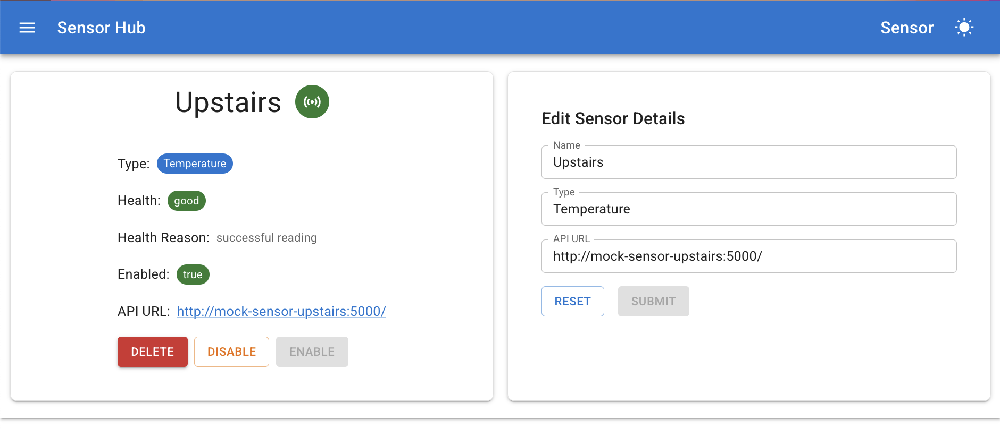

# Home temperature monitoring

A small self hosted setup for collecting, storing and viewing temperature readings from a few Raspberry Pis.

This repo contains the pieces I use to monitor a few DS18B20 sensors around the house. Three small Pis read sensors and expose a tiny HTTP endpoint. A fourth Pi runs the "sensor hub" service which gathers readings, stores them in MySQL, and serves a simple web UI with graphs and real time updates.

## Overview

- The backend that aggregates data and serves the UI is in `sensor_hub`.
- A minimal Flask API for the sensors is in `temperature_sensor`.
- The front end UI lives in `sensor_hub/ui/sensor_hub_ui`.

## What this does

- Collects temperature readings from networked sensors.
- Persists readings and sensor health into a MySQL database.
- Serves a REST API and a WebSocket channel for real time updates.
- Provides a small Single Page App for viewing dashboards and sensor details.

## Why it exists

Because I wanted a little playground to collect and visualise sensor data at home. It is intentionally simple and kept inside my home network. Security, auth and production hardening are minimal or absent by design.

## Quick layout

- `sensor_hub` - Go backend, API handlers, DB code, service layer and the UI build.
  - `sensor_hub/openapi.yaml` is the API contract for the REST endpoints.
  - `sensor_hub/ws/hub.go` and `sensor_hub/api/websocket.go` contain the WebSocket code.
- `temperature_sensor` - tiny Flask app that emulates a DS18B20 sensor for local testing.
- `sensor_hub/docker` and `sensor_hub/docker_tests` - docker compose files and helper scripts for running the system with a database or with fake sensors.
- `sensor_hub/db/changesets` - SQL migrations that define the schema used by the hub.

## Quick start

If you want to try the backend directly:

```bash
cd sensor_hub
# run the service directly
go run ./main.go

# or build a binary
go build -o sensor-hub ./...
./sensor-hub
```

Run with Docker and a local database

```bash
# from the repo root, build and start via docker compose
cd sensor_hub
docker-compose -f docker/docker-compose.yml build
docker-compose -f docker/docker-compose.yml up -d
```

Run the full stack with fake sensors (useful for testing the UI). This requires database.properties and application.properties in `sensor_hub/configuration/`.

TODO: doc how to create those files, and what they should contain.

```bash
# from the repo root
docker-compose -f sensor_hub/docker_tests/docker-compose.yml build
docker-compose -f sensor_hub/docker_tests/docker-compose.yml up -d
```

Run the UI locally

```bash
cd sensor_hub/ui/sensor_hub_ui
npm install
npm run dev
```

## API and WebSocket

- The REST API spec is at `sensor_hub/openapi.yaml`.
- WebSocket messages and topics are handled by the hub in `sensor_hub/ws/hub.go` and integrated in `sensor_hub/api/websocket.go`.

## Configuration and secrets

- Example property files and credentials live under `sensor_hub/configuration` and `sensor_hub/application_properties`.
- For Gmail SMTP and email alerts there is a small helper under `sensor_hub/pre_authorise_application` that helps produce the `credentials.json` and `token.json` files if you want to enable email.

## Testing and integration

- There are integration tests and a docker based test setup in `sensor_hub/integration` and `sensor_hub/docker_tests`.
- This is definitely lacking at the moment. 

## Notes and caveats

- This project is deliberately lightweight. I did not prioritise authentication or testing.
- The MySQL credentials are simple by intent. Do not expose this setup to an untrusted network without improving security.

## Where to look next

- To understand the API start with `sensor_hub/openapi.yaml`.
- To follow how readings are processed and stored, check `sensor_hub/service` and `sensor_hub/db`.
- To see the real time wiring, open `sensor_hub/ws/hub.go`.


